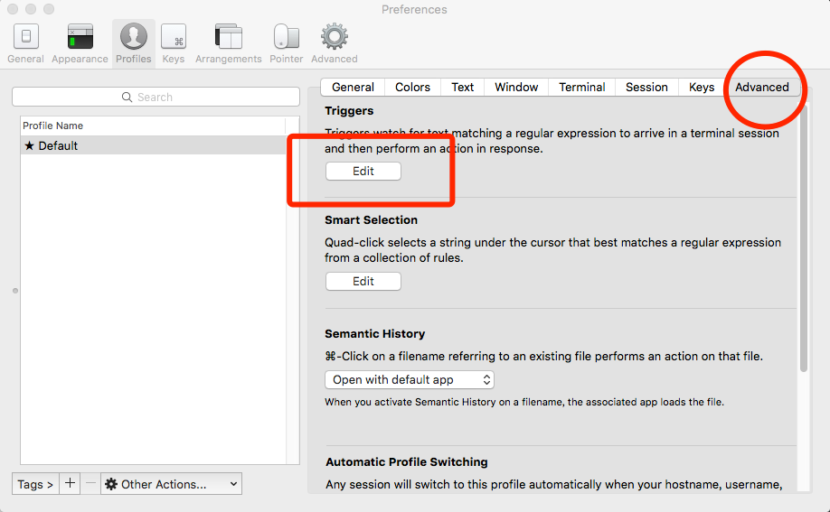
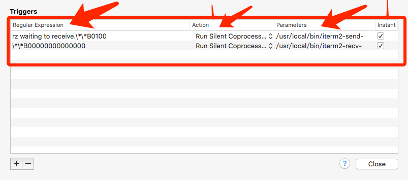

首先你肯定是OS X or MacOS
os x自带的终端或者iterm2在使用rz sz的时候会卡主

iterm2给了个解决方案
传送门:[https://github.com/mmastrac/iterm2-zmodem](https://github.com/mmastrac/iterm2-zmodem "github")

首先安装好Iterm2 还有Homebrew

然后
安装lrzsz
``` bash
brew install lrzsz
```
然后呢下载文件[https://codeload.github.com/mmastrac/iterm2-zmodem/zip/master](https://codeload.github.com/mmastrac/iterm2-zmodem/zip/master "rzsz")

解压然后将两个文件复制到/usr/loca/bin目录

然后打开iterm2 快捷键 command + , 或者找到首选项（preferences）-&gt;Profiles -&gt;Advanced -&gt;Triggers -Edit



添加两条触发
``` plain
第一条 发送
Regular expression: rz waiting to receive.\*\*B0100
Action: Run Silent Coprocess
Parameters: /usr/local/bin/iterm2-send-zmodem.sh
Instant: checked

第二条接收文件
Regular expression: \*\*B00000000000000
Action: Run Silent Coprocess
Parameters: /usr/local/bin/iterm2-recv-zmodem.sh
Instant: checked
``` 


然后就可以在iterm2里面使用rz sz命令了
在iterm2和OS X 10.11.6测试通过
